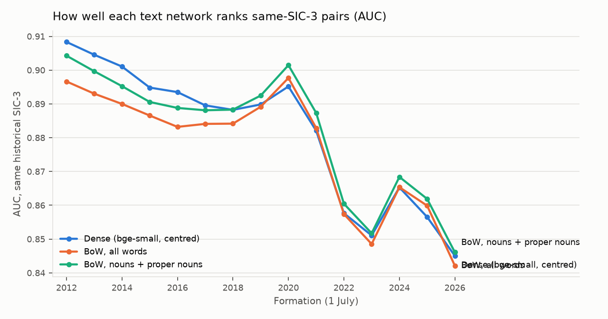
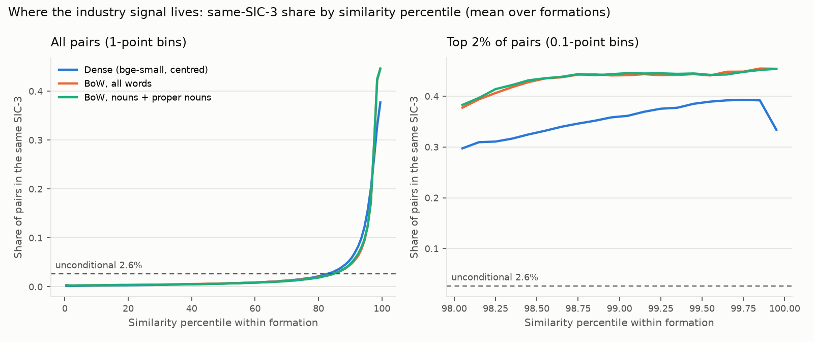
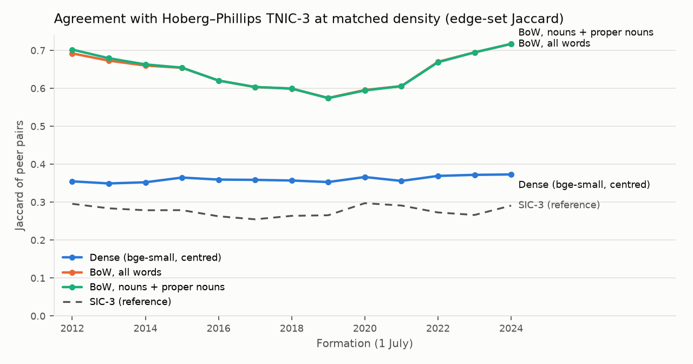

# Element A — text-network validation

Generated by `analysis/a_text_layer.py` (2026-09-27). Formations: 1 July 2012–2026; 3219–3783 firms per formation. Every text network is cut at the (1 − π) quantile, π = same-SIC-3 pair share, so all have SIC-3 density. SPAC firm-months are excluded (D8). `*_mult` / `*_add` / `*_null` are the D9 degree-corrected BoW networks: s/(m_i m_j), s − (m_i + m_j)/2 and s − m_i m_j / median(m), m_i = firm i's median similarity to the others.

## Averages over formations

| network | pi_sic3 | tau | q50 | q99 | auc_sic3 | auc_sic3_ex6799 | mean_within | mean_cross | precision_sic3 | recall_sic3 | jaccard_sic3 | corr_len_rowmean |
|---|---|---|---|---|---|---|---|---|---|---|---|---|
| dense | 2.62% | 0.320 | -0.019 | 0.407 | 0.882 | 0.889 | 0.240 | -0.007 | 0.335 | 0.335 | 0.201 | -0.29 |
| bow_all | 2.62% | 0.254 | 0.084 | 0.341 | 0.877 | 0.885 | 0.224 | 0.091 | 0.410 | 0.410 | 0.258 | +0.94 |
| bow_nouns | 2.62% | 0.272 | 0.084 | 0.363 | 0.882 | 0.889 | 0.238 | 0.093 | 0.413 | 0.413 | 0.260 | +0.93 |
| bow_all_mult | 2.62% | 32.700 | 11.584 | 43.142 | 0.905 | 0.913 | 30.176 | 12.709 | 0.416 | 0.417 | 0.263 | +0.32 |
| bow_all_add | 2.62% | 0.160 | -0.002 | 0.249 | 0.897 | 0.905 | 0.137 | 0.006 | 0.422 | 0.422 | 0.268 | +0.89 |
| bow_all_null | 2.62% | 0.153 | -0.001 | 0.242 | 0.908 | 0.916 | 0.135 | 0.007 | 0.432 | 0.432 | 0.276 | +0.56 |
| bow_nouns_mult | 2.62% | 35.593 | 11.541 | 46.975 | 0.902 | 0.911 | 32.366 | 12.843 | 0.411 | 0.411 | 0.259 | +0.31 |
| bow_nouns_add | 2.62% | 0.179 | -0.002 | 0.271 | 0.898 | 0.905 | 0.151 | 0.008 | 0.423 | 0.423 | 0.269 | +0.88 |
| bow_nouns_null | 2.62% | 0.173 | -0.001 | 0.266 | 0.905 | 0.914 | 0.150 | 0.008 | 0.431 | 0.432 | 0.275 | +0.55 |

precision/recall/Jaccard: text edges (s > τ) vs same-SIC-3 pairs. corr_len_rowmean: correlation across firms of log Item 1 length with the firm's mean similarity to all others (hub/length effect).

## Agreement with TNIC-3 at matched density (formations 2012-07-01–2024-07-01, means)

| network | jaccard | recall_tnic | auc_tnic | spearman_score |
|---|---|---|---|---|
| SIC-3 | 0.277 | 0.356 | — | — |
| dense | 0.361 | 0.438 | 0.951 | 0.389 |
| bow_all | 0.643 | 0.655 | 0.991 | 0.890 |
| bow_nouns | 0.644 | 0.655 | 0.992 | 0.906 |
| bow_all_mult | 0.544 | 0.586 | 0.987 | 0.669 |
| bow_all_add | 0.648 | 0.658 | 0.993 | 0.909 |
| bow_all_null | 0.648 | 0.658 | 0.993 | 0.898 |
| bow_nouns_mult | 0.532 | 0.578 | 0.986 | 0.649 |
| bow_nouns_add | 0.648 | 0.658 | 0.993 | 0.917 |
| bow_nouns_null | 0.647 | 0.657 | 0.993 | 0.902 |

jaccard: edge sets among firms covered by TNIC that year; recall_tnic: share of TNIC pairs that are edges; auc_tnic: AUC of s for TNIC membership; spearman_score: rank correlation of s with the TNIC score over TNIC pairs.

## Same-firm similarity with the previous formation's filing (means over formations)

| network | median | p10 |
|---|---|---|
| dense | 0.920 | 0.708 |
| bow_all | 0.898 | 0.743 |
| bow_nouns | 0.904 | 0.756 |

## Per formation

| formation | network | n_firms | n_sic6799 | pi_sic3 | tau | q50 | q99 | auc_sic3 | auc_sic3_ex6799 | precision_sic3 | jaccard_sic3 |
|---|---|---|---|---|---|---|---|---|---|---|---|
| 2012-07-01 | dense | 3320 | 4 | 2.14% | 0.325 | -0.018 | 0.393 | 0.908 | 0.908 | 0.336 | 0.202 |
| 2012-07-01 | bow_all | 3320 | 4 | 2.14% | 0.243 | 0.083 | 0.315 | 0.897 | 0.897 | 0.423 | 0.268 |
| 2012-07-01 | bow_nouns | 3320 | 4 | 2.14% | 0.260 | 0.082 | 0.337 | 0.904 | 0.904 | 0.429 | 0.273 |
| 2012-07-01 | bow_all_mult | 3320 | 4 | 2.14% | 32.516 | 11.640 | 41.428 | 0.927 | 0.927 | 0.418 | 0.264 |
| 2012-07-01 | bow_all_add | 3320 | 4 | 2.14% | 0.148 | -0.002 | 0.225 | 0.918 | 0.919 | 0.440 | 0.282 |
| 2012-07-01 | bow_all_null | 3320 | 4 | 2.14% | 0.141 | -0.001 | 0.221 | 0.930 | 0.930 | 0.450 | 0.291 |
| 2012-07-01 | bow_nouns_mult | 3320 | 4 | 2.14% | 37.053 | 11.853 | 47.125 | 0.924 | 0.924 | 0.414 | 0.261 |
| 2012-07-01 | bow_nouns_add | 3320 | 4 | 2.14% | 0.170 | -0.002 | 0.250 | 0.921 | 0.921 | 0.441 | 0.283 |
| 2012-07-01 | bow_nouns_null | 3320 | 4 | 2.14% | 0.164 | -0.001 | 0.246 | 0.928 | 0.929 | 0.448 | 0.289 |
| 2013-07-01 | dense | 3244 | 5 | 2.14% | 0.327 | -0.018 | 0.397 | 0.905 | 0.905 | 0.337 | 0.203 |
| 2013-07-01 | bow_all | 3244 | 5 | 2.14% | 0.246 | 0.084 | 0.320 | 0.893 | 0.893 | 0.410 | 0.258 |
| 2013-07-01 | bow_nouns | 3244 | 5 | 2.14% | 0.264 | 0.083 | 0.343 | 0.900 | 0.900 | 0.414 | 0.261 |
| 2013-07-01 | bow_all_mult | 3244 | 5 | 2.14% | 32.489 | 11.612 | 41.118 | 0.924 | 0.924 | 0.408 | 0.257 |
| 2013-07-01 | bow_all_add | 3244 | 5 | 2.14% | 0.151 | -0.002 | 0.229 | 0.915 | 0.915 | 0.425 | 0.270 |
| 2013-07-01 | bow_all_null | 3244 | 5 | 2.14% | 0.143 | -0.001 | 0.224 | 0.928 | 0.928 | 0.436 | 0.279 |
| 2013-07-01 | bow_nouns_mult | 3244 | 5 | 2.14% | 36.720 | 11.787 | 46.254 | 0.923 | 0.923 | 0.405 | 0.254 |
| 2013-07-01 | bow_nouns_add | 3244 | 5 | 2.14% | 0.172 | -0.002 | 0.255 | 0.917 | 0.917 | 0.426 | 0.270 |
| 2013-07-01 | bow_nouns_null | 3244 | 5 | 2.14% | 0.165 | -0.001 | 0.250 | 0.926 | 0.927 | 0.434 | 0.277 |
| 2014-07-01 | dense | 3320 | 14 | 2.15% | 0.329 | -0.018 | 0.400 | 0.901 | 0.902 | 0.334 | 0.201 |
| 2014-07-01 | bow_all | 3320 | 14 | 2.15% | 0.252 | 0.084 | 0.326 | 0.890 | 0.891 | 0.404 | 0.253 |
| 2014-07-01 | bow_nouns | 3320 | 14 | 2.15% | 0.270 | 0.083 | 0.351 | 0.895 | 0.896 | 0.405 | 0.254 |
| 2014-07-01 | bow_all_mult | 3320 | 14 | 2.15% | 32.533 | 11.565 | 41.091 | 0.921 | 0.921 | 0.405 | 0.254 |
| 2014-07-01 | bow_all_add | 3320 | 14 | 2.15% | 0.156 | -0.002 | 0.235 | 0.912 | 0.913 | 0.417 | 0.264 |
| 2014-07-01 | bow_all_null | 3320 | 14 | 2.15% | 0.147 | -0.001 | 0.229 | 0.924 | 0.925 | 0.427 | 0.271 |
| 2014-07-01 | bow_nouns_mult | 3320 | 14 | 2.15% | 36.658 | 11.720 | 46.100 | 0.918 | 0.919 | 0.400 | 0.250 |
| 2014-07-01 | bow_nouns_add | 3320 | 14 | 2.15% | 0.177 | -0.002 | 0.261 | 0.913 | 0.914 | 0.416 | 0.262 |
| 2014-07-01 | bow_nouns_null | 3320 | 14 | 2.15% | 0.169 | -0.001 | 0.255 | 0.922 | 0.923 | 0.424 | 0.269 |
| 2015-07-01 | dense | 3382 | 18 | 2.23% | 0.329 | -0.018 | 0.403 | 0.895 | 0.896 | 0.330 | 0.198 |
| 2015-07-01 | bow_all | 3382 | 18 | 2.23% | 0.253 | 0.082 | 0.328 | 0.887 | 0.888 | 0.411 | 0.259 |
| 2015-07-01 | bow_nouns | 3382 | 18 | 2.23% | 0.272 | 0.082 | 0.353 | 0.891 | 0.892 | 0.412 | 0.260 |
| 2015-07-01 | bow_all_mult | 3382 | 18 | 2.23% | 33.363 | 11.723 | 42.444 | 0.914 | 0.915 | 0.408 | 0.256 |
| 2015-07-01 | bow_all_add | 3382 | 18 | 2.23% | 0.159 | -0.002 | 0.238 | 0.907 | 0.908 | 0.423 | 0.269 |
| 2015-07-01 | bow_all_null | 3382 | 18 | 2.23% | 0.150 | -0.001 | 0.232 | 0.918 | 0.919 | 0.433 | 0.276 |
| 2015-07-01 | bow_nouns_mult | 3382 | 18 | 2.23% | 37.209 | 11.816 | 47.113 | 0.911 | 0.912 | 0.404 | 0.253 |
| 2015-07-01 | bow_nouns_add | 3382 | 18 | 2.23% | 0.180 | -0.002 | 0.264 | 0.907 | 0.908 | 0.423 | 0.268 |
| 2015-07-01 | bow_nouns_null | 3382 | 18 | 2.23% | 0.173 | -0.001 | 0.258 | 0.915 | 0.916 | 0.430 | 0.274 |
| 2016-07-01 | dense | 3266 | 26 | 2.29% | 0.329 | -0.019 | 0.404 | 0.894 | 0.895 | 0.334 | 0.201 |
| 2016-07-01 | bow_all | 3266 | 26 | 2.29% | 0.257 | 0.082 | 0.329 | 0.883 | 0.885 | 0.402 | 0.252 |
| 2016-07-01 | bow_nouns | 3266 | 26 | 2.29% | 0.275 | 0.082 | 0.353 | 0.889 | 0.891 | 0.404 | 0.253 |
| 2016-07-01 | bow_all_mult | 3266 | 26 | 2.29% | 33.603 | 11.741 | 42.471 | 0.911 | 0.913 | 0.401 | 0.251 |
| 2016-07-01 | bow_all_add | 3266 | 26 | 2.29% | 0.163 | -0.002 | 0.239 | 0.904 | 0.906 | 0.414 | 0.261 |
| 2016-07-01 | bow_all_null | 3266 | 26 | 2.29% | 0.155 | -0.001 | 0.232 | 0.914 | 0.916 | 0.423 | 0.268 |
| 2016-07-01 | bow_nouns_mult | 3266 | 26 | 2.29% | 37.240 | 11.813 | 46.982 | 0.908 | 0.910 | 0.397 | 0.247 |
| 2016-07-01 | bow_nouns_add | 3266 | 26 | 2.29% | 0.183 | -0.002 | 0.263 | 0.905 | 0.907 | 0.414 | 0.261 |
| 2016-07-01 | bow_nouns_null | 3266 | 26 | 2.29% | 0.177 | -0.001 | 0.257 | 0.912 | 0.914 | 0.420 | 0.266 |
| 2017-07-01 | dense | 3219 | 28 | 2.22% | 0.334 | -0.018 | 0.407 | 0.890 | 0.892 | 0.321 | 0.191 |
| 2017-07-01 | bow_all | 3219 | 28 | 2.22% | 0.265 | 0.083 | 0.333 | 0.884 | 0.886 | 0.394 | 0.245 |
| 2017-07-01 | bow_nouns | 3219 | 28 | 2.22% | 0.285 | 0.083 | 0.357 | 0.888 | 0.890 | 0.396 | 0.247 |
| 2017-07-01 | bow_all_mult | 3219 | 28 | 2.22% | 33.789 | 11.664 | 41.866 | 0.909 | 0.912 | 0.392 | 0.244 |
| 2017-07-01 | bow_all_add | 3219 | 28 | 2.22% | 0.171 | -0.002 | 0.241 | 0.903 | 0.906 | 0.406 | 0.255 |
| 2017-07-01 | bow_all_null | 3219 | 28 | 2.22% | 0.163 | -0.001 | 0.234 | 0.913 | 0.915 | 0.415 | 0.262 |
| 2017-07-01 | bow_nouns_mult | 3219 | 28 | 2.22% | 37.453 | 11.732 | 46.452 | 0.907 | 0.909 | 0.386 | 0.239 |
| 2017-07-01 | bow_nouns_add | 3219 | 28 | 2.22% | 0.193 | -0.002 | 0.267 | 0.903 | 0.906 | 0.406 | 0.255 |
| 2017-07-01 | bow_nouns_null | 3219 | 28 | 2.22% | 0.186 | -0.001 | 0.260 | 0.910 | 0.913 | 0.414 | 0.261 |
| 2018-07-01 | dense | 3230 | 27 | 2.31% | 0.330 | -0.019 | 0.406 | 0.888 | 0.890 | 0.322 | 0.192 |
| 2018-07-01 | bow_all | 3230 | 27 | 2.31% | 0.266 | 0.082 | 0.337 | 0.884 | 0.886 | 0.405 | 0.254 |
| 2018-07-01 | bow_nouns | 3230 | 27 | 2.31% | 0.287 | 0.082 | 0.361 | 0.888 | 0.890 | 0.406 | 0.255 |
| 2018-07-01 | bow_all_mult | 3230 | 27 | 2.31% | 34.648 | 11.772 | 43.086 | 0.913 | 0.915 | 0.403 | 0.252 |
| 2018-07-01 | bow_all_add | 3230 | 27 | 2.31% | 0.173 | -0.002 | 0.246 | 0.904 | 0.906 | 0.418 | 0.264 |
| 2018-07-01 | bow_all_null | 3230 | 27 | 2.31% | 0.165 | -0.001 | 0.238 | 0.916 | 0.918 | 0.427 | 0.271 |
| 2018-07-01 | bow_nouns_mult | 3230 | 27 | 2.31% | 37.939 | 11.767 | 47.197 | 0.910 | 0.912 | 0.399 | 0.249 |
| 2018-07-01 | bow_nouns_add | 3230 | 27 | 2.31% | 0.195 | -0.002 | 0.270 | 0.904 | 0.907 | 0.417 | 0.264 |
| 2018-07-01 | bow_nouns_null | 3230 | 27 | 2.31% | 0.188 | -0.001 | 0.263 | 0.913 | 0.915 | 0.425 | 0.270 |
| 2019-07-01 | dense | 3251 | 31 | 2.45% | 0.329 | -0.019 | 0.412 | 0.890 | 0.892 | 0.330 | 0.197 |
| 2019-07-01 | bow_all | 3251 | 31 | 2.45% | 0.274 | 0.082 | 0.349 | 0.889 | 0.892 | 0.408 | 0.256 |
| 2019-07-01 | bow_nouns | 3251 | 31 | 2.45% | 0.296 | 0.083 | 0.374 | 0.892 | 0.895 | 0.410 | 0.258 |
| 2019-07-01 | bow_all_mult | 3251 | 31 | 2.45% | 35.347 | 11.787 | 44.041 | 0.914 | 0.917 | 0.414 | 0.261 |
| 2019-07-01 | bow_all_add | 3251 | 31 | 2.45% | 0.181 | -0.002 | 0.257 | 0.908 | 0.910 | 0.420 | 0.266 |
| 2019-07-01 | bow_all_null | 3251 | 31 | 2.45% | 0.173 | -0.001 | 0.248 | 0.917 | 0.919 | 0.431 | 0.274 |
| 2019-07-01 | bow_nouns_mult | 3251 | 31 | 2.45% | 37.812 | 11.653 | 47.155 | 0.911 | 0.914 | 0.410 | 0.258 |
| 2019-07-01 | bow_nouns_add | 3251 | 31 | 2.45% | 0.203 | -0.002 | 0.282 | 0.907 | 0.910 | 0.421 | 0.267 |
| 2019-07-01 | bow_nouns_null | 3251 | 31 | 2.45% | 0.196 | -0.001 | 0.273 | 0.914 | 0.917 | 0.430 | 0.274 |
| 2020-07-01 | dense | 3250 | 26 | 2.78% | 0.320 | -0.019 | 0.415 | 0.895 | 0.896 | 0.367 | 0.224 |
| 2020-07-01 | bow_all | 3250 | 26 | 2.78% | 0.263 | 0.081 | 0.353 | 0.898 | 0.899 | 0.447 | 0.288 |
| 2020-07-01 | bow_nouns | 3250 | 26 | 2.78% | 0.284 | 0.082 | 0.376 | 0.901 | 0.903 | 0.450 | 0.290 |
| 2020-07-01 | bow_all_mult | 3250 | 26 | 2.78% | 35.289 | 11.877 | 45.773 | 0.922 | 0.923 | 0.452 | 0.292 |
| 2020-07-01 | bow_all_add | 3250 | 26 | 2.78% | 0.171 | -0.002 | 0.261 | 0.915 | 0.916 | 0.459 | 0.298 |
| 2020-07-01 | bow_all_null | 3250 | 26 | 2.78% | 0.163 | -0.001 | 0.253 | 0.925 | 0.926 | 0.471 | 0.308 |
| 2020-07-01 | bow_nouns_mult | 3250 | 26 | 2.78% | 38.026 | 11.757 | 49.636 | 0.920 | 0.921 | 0.448 | 0.289 |
| 2020-07-01 | bow_nouns_add | 3250 | 26 | 2.78% | 0.192 | -0.002 | 0.285 | 0.916 | 0.917 | 0.461 | 0.299 |
| 2020-07-01 | bow_nouns_null | 3250 | 26 | 2.78% | 0.185 | -0.001 | 0.278 | 0.923 | 0.924 | 0.471 | 0.308 |
| 2021-07-01 | dense | 3415 | 57 | 2.96% | 0.317 | -0.019 | 0.414 | 0.882 | 0.886 | 0.335 | 0.201 |
| 2021-07-01 | bow_all | 3415 | 57 | 2.96% | 0.263 | 0.083 | 0.353 | 0.883 | 0.888 | 0.418 | 0.265 |
| 2021-07-01 | bow_nouns | 3415 | 57 | 2.96% | 0.282 | 0.085 | 0.373 | 0.887 | 0.892 | 0.422 | 0.268 |
| 2021-07-01 | bow_all_mult | 3415 | 57 | 2.96% | 33.899 | 11.620 | 45.266 | 0.910 | 0.915 | 0.431 | 0.275 |
| 2021-07-01 | bow_all_add | 3415 | 57 | 2.96% | 0.172 | -0.002 | 0.260 | 0.901 | 0.906 | 0.429 | 0.273 |
| 2021-07-01 | bow_all_null | 3415 | 57 | 2.96% | 0.166 | -0.001 | 0.253 | 0.912 | 0.917 | 0.437 | 0.280 |
| 2021-07-01 | bow_nouns_mult | 3415 | 57 | 2.96% | 36.115 | 11.454 | 48.629 | 0.908 | 0.913 | 0.426 | 0.271 |
| 2021-07-01 | bow_nouns_add | 3415 | 57 | 2.96% | 0.190 | -0.002 | 0.280 | 0.902 | 0.907 | 0.431 | 0.275 |
| 2021-07-01 | bow_nouns_null | 3415 | 57 | 2.96% | 0.186 | -0.001 | 0.275 | 0.911 | 0.915 | 0.437 | 0.280 |
| 2022-07-01 | dense | 3783 | 155 | 3.26% | 0.306 | -0.019 | 0.413 | 0.858 | 0.877 | 0.327 | 0.195 |
| 2022-07-01 | bow_all | 3783 | 155 | 3.26% | 0.253 | 0.086 | 0.353 | 0.857 | 0.875 | 0.396 | 0.247 |
| 2022-07-01 | bow_nouns | 3783 | 155 | 3.26% | 0.269 | 0.087 | 0.370 | 0.860 | 0.879 | 0.399 | 0.249 |
| 2022-07-01 | bow_all_mult | 3783 | 155 | 3.26% | 32.080 | 11.374 | 45.472 | 0.883 | 0.903 | 0.407 | 0.255 |
| 2022-07-01 | bow_all_add | 3783 | 155 | 3.26% | 0.160 | -0.002 | 0.260 | 0.876 | 0.894 | 0.406 | 0.255 |
| 2022-07-01 | bow_all_null | 3783 | 155 | 3.26% | 0.155 | -0.001 | 0.256 | 0.885 | 0.905 | 0.414 | 0.261 |
| 2022-07-01 | bow_nouns_mult | 3783 | 155 | 3.26% | 33.964 | 11.190 | 48.575 | 0.880 | 0.900 | 0.401 | 0.251 |
| 2022-07-01 | bow_nouns_add | 3783 | 155 | 3.26% | 0.175 | -0.002 | 0.278 | 0.875 | 0.895 | 0.408 | 0.256 |
| 2022-07-01 | bow_nouns_null | 3783 | 155 | 3.26% | 0.172 | -0.001 | 0.276 | 0.882 | 0.903 | 0.414 | 0.261 |
| 2023-07-01 | dense | 3763 | 164 | 3.14% | 0.308 | -0.019 | 0.412 | 0.851 | 0.874 | 0.330 | 0.197 |
| 2023-07-01 | bow_all | 3763 | 164 | 3.14% | 0.248 | 0.086 | 0.351 | 0.849 | 0.870 | 0.398 | 0.248 |
| 2023-07-01 | bow_nouns | 3763 | 164 | 3.14% | 0.264 | 0.088 | 0.370 | 0.852 | 0.874 | 0.400 | 0.250 |
| 2023-07-01 | bow_all_mult | 3763 | 164 | 3.14% | 31.504 | 11.356 | 44.639 | 0.877 | 0.900 | 0.408 | 0.256 |
| 2023-07-01 | bow_all_add | 3763 | 164 | 3.14% | 0.154 | -0.002 | 0.258 | 0.868 | 0.890 | 0.407 | 0.256 |
| 2023-07-01 | bow_all_null | 3763 | 164 | 3.14% | 0.149 | -0.001 | 0.254 | 0.878 | 0.902 | 0.416 | 0.262 |
| 2023-07-01 | bow_nouns_mult | 3763 | 164 | 3.14% | 33.178 | 11.144 | 47.141 | 0.873 | 0.897 | 0.403 | 0.252 |
| 2023-07-01 | bow_nouns_add | 3763 | 164 | 3.14% | 0.170 | -0.001 | 0.277 | 0.868 | 0.890 | 0.410 | 0.258 |
| 2023-07-01 | bow_nouns_null | 3763 | 164 | 3.14% | 0.165 | -0.001 | 0.274 | 0.875 | 0.899 | 0.417 | 0.264 |
| 2024-07-01 | dense | 3646 | 129 | 3.15% | 0.306 | -0.019 | 0.413 | 0.865 | 0.882 | 0.356 | 0.217 |
| 2024-07-01 | bow_all | 3646 | 129 | 3.15% | 0.243 | 0.086 | 0.355 | 0.865 | 0.882 | 0.423 | 0.268 |
| 2024-07-01 | bow_nouns | 3646 | 129 | 3.15% | 0.260 | 0.088 | 0.373 | 0.868 | 0.885 | 0.427 | 0.271 |
| 2024-07-01 | bow_all_mult | 3646 | 129 | 3.15% | 30.225 | 11.353 | 43.886 | 0.895 | 0.912 | 0.445 | 0.286 |
| 2024-07-01 | bow_all_add | 3646 | 129 | 3.15% | 0.148 | -0.002 | 0.261 | 0.886 | 0.902 | 0.434 | 0.277 |
| 2024-07-01 | bow_all_null | 3646 | 129 | 3.15% | 0.141 | -0.001 | 0.255 | 0.896 | 0.913 | 0.445 | 0.286 |
| 2024-07-01 | bow_nouns_mult | 3646 | 129 | 3.15% | 31.723 | 11.107 | 46.355 | 0.891 | 0.909 | 0.438 | 0.280 |
| 2024-07-01 | bow_nouns_add | 3646 | 129 | 3.15% | 0.163 | -0.002 | 0.279 | 0.885 | 0.902 | 0.438 | 0.280 |
| 2024-07-01 | bow_nouns_null | 3646 | 129 | 3.15% | 0.158 | -0.001 | 0.276 | 0.893 | 0.911 | 0.447 | 0.288 |
| 2025-07-01 | dense | 3549 | 135 | 3.12% | 0.307 | -0.019 | 0.411 | 0.857 | 0.875 | 0.343 | 0.207 |
| 2025-07-01 | bow_all | 3549 | 135 | 3.12% | 0.243 | 0.085 | 0.357 | 0.860 | 0.879 | 0.417 | 0.264 |
| 2025-07-01 | bow_nouns | 3549 | 135 | 3.12% | 0.259 | 0.087 | 0.376 | 0.862 | 0.881 | 0.421 | 0.266 |
| 2025-07-01 | bow_all_mult | 3549 | 135 | 3.12% | 30.100 | 11.376 | 43.144 | 0.888 | 0.907 | 0.437 | 0.280 |
| 2025-07-01 | bow_all_add | 3549 | 135 | 3.12% | 0.147 | -0.002 | 0.263 | 0.879 | 0.899 | 0.428 | 0.272 |
| 2025-07-01 | bow_all_null | 3549 | 135 | 3.12% | 0.141 | -0.001 | 0.256 | 0.889 | 0.909 | 0.438 | 0.281 |
| 2025-07-01 | bow_nouns_mult | 3549 | 135 | 3.12% | 31.763 | 11.195 | 45.787 | 0.884 | 0.904 | 0.428 | 0.273 |
| 2025-07-01 | bow_nouns_add | 3549 | 135 | 3.12% | 0.163 | -0.002 | 0.281 | 0.878 | 0.898 | 0.430 | 0.274 |
| 2025-07-01 | bow_nouns_null | 3549 | 135 | 3.12% | 0.156 | -0.001 | 0.276 | 0.886 | 0.906 | 0.440 | 0.282 |
| 2026-07-01 | dense | 3452 | 134 | 2.99% | 0.307 | -0.019 | 0.408 | 0.845 | 0.865 | 0.326 | 0.195 |
| 2026-07-01 | bow_all | 3452 | 134 | 2.99% | 0.242 | 0.086 | 0.353 | 0.842 | 0.862 | 0.397 | 0.248 |
| 2026-07-01 | bow_nouns | 3452 | 134 | 2.99% | 0.259 | 0.088 | 0.373 | 0.846 | 0.866 | 0.401 | 0.251 |
| 2026-07-01 | bow_all_mult | 3452 | 134 | 2.99% | 29.111 | 11.300 | 41.400 | 0.872 | 0.893 | 0.418 | 0.265 |
| 2026-07-01 | bow_all_add | 3452 | 134 | 2.99% | 0.144 | -0.002 | 0.257 | 0.862 | 0.883 | 0.408 | 0.257 |
| 2026-07-01 | bow_all_null | 3452 | 134 | 2.99% | 0.136 | -0.001 | 0.250 | 0.872 | 0.894 | 0.420 | 0.266 |
| 2026-07-01 | bow_nouns_mult | 3452 | 134 | 2.99% | 31.035 | 11.123 | 44.120 | 0.869 | 0.890 | 0.409 | 0.257 |
| 2026-07-01 | bow_nouns_add | 3452 | 134 | 2.99% | 0.161 | -0.002 | 0.277 | 0.863 | 0.884 | 0.410 | 0.258 |
| 2026-07-01 | bow_nouns_null | 3452 | 134 | 2.99% | 0.154 | -0.001 | 0.272 | 0.870 | 0.892 | 0.419 | 0.266 |

| formation | network | firms_covered | jaccard | recall_tnic | auc_tnic | spearman_score |
|---|---|---|---|---|---|---|
| 2012-07-01 | SIC-3 | 3090 | 0.296 | 0.387 | — | — |
| 2012-07-01 | dense | 3090 | 0.355 | 0.448 | 0.958 | 0.299 |
| 2012-07-01 | bow_all | 3090 | 0.692 | 0.709 | 0.994 | 0.873 |
| 2012-07-01 | bow_nouns | 3090 | 0.702 | 0.715 | 0.996 | 0.903 |
| 2012-07-01 | bow_all_mult | 3090 | 0.569 | 0.623 | 0.990 | 0.663 |
| 2012-07-01 | bow_all_add | 3090 | 0.705 | 0.717 | 0.996 | 0.902 |
| 2012-07-01 | bow_all_null | 3090 | 0.703 | 0.716 | 0.996 | 0.896 |
| 2012-07-01 | bow_nouns_mult | 3090 | 0.556 | 0.614 | 0.990 | 0.634 |
| 2012-07-01 | bow_nouns_add | 3090 | 0.706 | 0.718 | 0.997 | 0.919 |
| 2012-07-01 | bow_nouns_null | 3090 | 0.703 | 0.716 | 0.997 | 0.904 |
| 2013-07-01 | SIC-3 | 3015 | 0.284 | 0.374 | — | — |
| 2013-07-01 | dense | 3015 | 0.349 | 0.441 | 0.954 | 0.316 |
| 2013-07-01 | bow_all | 3015 | 0.673 | 0.695 | 0.991 | 0.862 |
| 2013-07-01 | bow_nouns | 3015 | 0.679 | 0.699 | 0.992 | 0.885 |
| 2013-07-01 | bow_all_mult | 3015 | 0.557 | 0.613 | 0.985 | 0.651 |
| 2013-07-01 | bow_all_add | 3015 | 0.684 | 0.702 | 0.993 | 0.888 |
| 2013-07-01 | bow_all_null | 3015 | 0.682 | 0.701 | 0.992 | 0.881 |
| 2013-07-01 | bow_nouns_mult | 3015 | 0.543 | 0.604 | 0.985 | 0.622 |
| 2013-07-01 | bow_nouns_add | 3015 | 0.684 | 0.702 | 0.993 | 0.900 |
| 2013-07-01 | bow_nouns_null | 3015 | 0.683 | 0.701 | 0.992 | 0.886 |
| 2014-07-01 | SIC-3 | 3078 | 0.279 | 0.364 | — | — |
| 2014-07-01 | dense | 3078 | 0.352 | 0.436 | 0.953 | 0.349 |
| 2014-07-01 | bow_all | 3078 | 0.660 | 0.673 | 0.993 | 0.900 |
| 2014-07-01 | bow_nouns | 3078 | 0.663 | 0.675 | 0.994 | 0.922 |
| 2014-07-01 | bow_all_mult | 3078 | 0.543 | 0.595 | 0.986 | 0.696 |
| 2014-07-01 | bow_all_add | 3078 | 0.666 | 0.677 | 0.994 | 0.923 |
| 2014-07-01 | bow_all_null | 3078 | 0.668 | 0.679 | 0.993 | 0.916 |
| 2014-07-01 | bow_nouns_mult | 3078 | 0.529 | 0.584 | 0.986 | 0.666 |
| 2014-07-01 | bow_nouns_add | 3078 | 0.667 | 0.678 | 0.995 | 0.936 |
| 2014-07-01 | bow_nouns_null | 3078 | 0.667 | 0.678 | 0.993 | 0.921 |
| 2015-07-01 | SIC-3 | 3169 | 0.279 | 0.362 | — | — |
| 2015-07-01 | dense | 3169 | 0.365 | 0.446 | 0.957 | 0.358 |
| 2015-07-01 | bow_all | 3169 | 0.654 | 0.665 | 0.992 | 0.903 |
| 2015-07-01 | bow_nouns | 3169 | 0.655 | 0.666 | 0.993 | 0.926 |
| 2015-07-01 | bow_all_mult | 3169 | 0.539 | 0.587 | 0.987 | 0.688 |
| 2015-07-01 | bow_all_add | 3169 | 0.659 | 0.669 | 0.994 | 0.926 |
| 2015-07-01 | bow_all_null | 3169 | 0.660 | 0.670 | 0.995 | 0.916 |
| 2015-07-01 | bow_nouns_mult | 3169 | 0.527 | 0.578 | 0.987 | 0.663 |
| 2015-07-01 | bow_nouns_add | 3169 | 0.658 | 0.669 | 0.995 | 0.938 |
| 2015-07-01 | bow_nouns_null | 3169 | 0.660 | 0.670 | 0.995 | 0.923 |
| 2016-07-01 | SIC-3 | 3071 | 0.263 | 0.340 | — | — |
| 2016-07-01 | dense | 3071 | 0.360 | 0.436 | 0.951 | 0.369 |
| 2016-07-01 | bow_all | 3071 | 0.621 | 0.636 | 0.987 | 0.859 |
| 2016-07-01 | bow_nouns | 3071 | 0.620 | 0.636 | 0.988 | 0.879 |
| 2016-07-01 | bow_all_mult | 3071 | 0.506 | 0.555 | 0.981 | 0.646 |
| 2016-07-01 | bow_all_add | 3071 | 0.623 | 0.638 | 0.989 | 0.878 |
| 2016-07-01 | bow_all_null | 3071 | 0.623 | 0.638 | 0.989 | 0.867 |
| 2016-07-01 | bow_nouns_mult | 3071 | 0.495 | 0.546 | 0.981 | 0.626 |
| 2016-07-01 | bow_nouns_add | 3071 | 0.622 | 0.637 | 0.990 | 0.890 |
| 2016-07-01 | bow_nouns_null | 3071 | 0.622 | 0.637 | 0.989 | 0.873 |
| 2017-07-01 | SIC-3 | 3030 | 0.255 | 0.327 | — | — |
| 2017-07-01 | dense | 3030 | 0.359 | 0.429 | 0.955 | 0.414 |
| 2017-07-01 | bow_all | 3030 | 0.603 | 0.616 | 0.990 | 0.870 |
| 2017-07-01 | bow_nouns | 3030 | 0.604 | 0.617 | 0.992 | 0.889 |
| 2017-07-01 | bow_all_mult | 3030 | 0.497 | 0.541 | 0.984 | 0.644 |
| 2017-07-01 | bow_all_add | 3030 | 0.605 | 0.618 | 0.992 | 0.889 |
| 2017-07-01 | bow_all_null | 3030 | 0.605 | 0.618 | 0.992 | 0.877 |
| 2017-07-01 | bow_nouns_mult | 3030 | 0.489 | 0.535 | 0.984 | 0.627 |
| 2017-07-01 | bow_nouns_add | 3030 | 0.606 | 0.618 | 0.993 | 0.900 |
| 2017-07-01 | bow_nouns_null | 3030 | 0.606 | 0.618 | 0.992 | 0.883 |
| 2018-07-01 | SIC-3 | 3037 | 0.264 | 0.335 | — | — |
| 2018-07-01 | dense | 3037 | 0.357 | 0.426 | 0.952 | 0.419 |
| 2018-07-01 | bow_all | 3037 | 0.599 | 0.608 | 0.989 | 0.866 |
| 2018-07-01 | bow_nouns | 3037 | 0.600 | 0.609 | 0.990 | 0.883 |
| 2018-07-01 | bow_all_mult | 3037 | 0.497 | 0.536 | 0.984 | 0.644 |
| 2018-07-01 | bow_all_add | 3037 | 0.602 | 0.610 | 0.991 | 0.885 |
| 2018-07-01 | bow_all_null | 3037 | 0.602 | 0.610 | 0.991 | 0.875 |
| 2018-07-01 | bow_nouns_mult | 3037 | 0.485 | 0.527 | 0.983 | 0.626 |
| 2018-07-01 | bow_nouns_add | 3037 | 0.602 | 0.610 | 0.992 | 0.895 |
| 2018-07-01 | bow_nouns_null | 3037 | 0.602 | 0.610 | 0.992 | 0.881 |
| 2019-07-01 | SIC-3 | 3047 | 0.266 | 0.330 | — | — |
| 2019-07-01 | dense | 3047 | 0.353 | 0.414 | 0.950 | 0.442 |
| 2019-07-01 | bow_all | 3047 | 0.575 | 0.583 | 0.987 | 0.882 |
| 2019-07-01 | bow_nouns | 3047 | 0.574 | 0.583 | 0.989 | 0.893 |
| 2019-07-01 | bow_all_mult | 3047 | 0.487 | 0.521 | 0.982 | 0.644 |
| 2019-07-01 | bow_all_add | 3047 | 0.576 | 0.584 | 0.989 | 0.896 |
| 2019-07-01 | bow_all_null | 3047 | 0.575 | 0.584 | 0.990 | 0.882 |
| 2019-07-01 | bow_nouns_mult | 3047 | 0.477 | 0.514 | 0.982 | 0.624 |
| 2019-07-01 | bow_nouns_add | 3047 | 0.575 | 0.583 | 0.990 | 0.902 |
| 2019-07-01 | bow_nouns_null | 3047 | 0.574 | 0.583 | 0.990 | 0.885 |
| 2020-07-01 | SIC-3 | 3029 | 0.297 | 0.367 | — | — |
| 2020-07-01 | dense | 3029 | 0.366 | 0.432 | 0.948 | 0.443 |
| 2020-07-01 | bow_all | 3029 | 0.596 | 0.607 | 0.986 | 0.891 |
| 2020-07-01 | bow_nouns | 3029 | 0.594 | 0.606 | 0.987 | 0.900 |
| 2020-07-01 | bow_all_mult | 3029 | 0.505 | 0.543 | 0.981 | 0.643 |
| 2020-07-01 | bow_all_add | 3029 | 0.596 | 0.607 | 0.988 | 0.904 |
| 2020-07-01 | bow_all_null | 3029 | 0.595 | 0.606 | 0.989 | 0.890 |
| 2020-07-01 | bow_nouns_mult | 3029 | 0.496 | 0.537 | 0.981 | 0.630 |
| 2020-07-01 | bow_nouns_add | 3029 | 0.595 | 0.606 | 0.989 | 0.909 |
| 2020-07-01 | bow_nouns_null | 3029 | 0.594 | 0.606 | 0.989 | 0.892 |
| 2021-07-01 | SIC-3 | 3128 | 0.291 | 0.358 | — | — |
| 2021-07-01 | dense | 3128 | 0.356 | 0.419 | 0.949 | 0.433 |
| 2021-07-01 | bow_all | 3128 | 0.606 | 0.609 | 0.992 | 0.914 |
| 2021-07-01 | bow_nouns | 3128 | 0.606 | 0.609 | 0.992 | 0.920 |
| 2021-07-01 | bow_all_mult | 3128 | 0.550 | 0.572 | 0.990 | 0.680 |
| 2021-07-01 | bow_all_add | 3128 | 0.609 | 0.611 | 0.994 | 0.927 |
| 2021-07-01 | bow_all_null | 3128 | 0.610 | 0.613 | 0.996 | 0.915 |
| 2021-07-01 | bow_nouns_mult | 3128 | 0.538 | 0.564 | 0.989 | 0.658 |
| 2021-07-01 | bow_nouns_add | 3128 | 0.608 | 0.611 | 0.994 | 0.928 |
| 2021-07-01 | bow_nouns_null | 3128 | 0.609 | 0.612 | 0.996 | 0.912 |
| 2022-07-01 | SIC-3 | 3496 | 0.273 | 0.352 | — | — |
| 2022-07-01 | dense | 3496 | 0.369 | 0.446 | 0.943 | 0.409 |
| 2022-07-01 | bow_all | 3496 | 0.670 | 0.674 | 0.993 | 0.912 |
| 2022-07-01 | bow_nouns | 3496 | 0.669 | 0.674 | 0.994 | 0.920 |
| 2022-07-01 | bow_all_mult | 3496 | 0.600 | 0.627 | 0.991 | 0.690 |
| 2022-07-01 | bow_all_add | 3496 | 0.673 | 0.676 | 0.995 | 0.925 |
| 2022-07-01 | bow_all_null | 3496 | 0.672 | 0.676 | 0.996 | 0.914 |
| 2022-07-01 | bow_nouns_mult | 3496 | 0.588 | 0.619 | 0.991 | 0.672 |
| 2022-07-01 | bow_nouns_add | 3496 | 0.671 | 0.675 | 0.996 | 0.928 |
| 2022-07-01 | bow_nouns_null | 3496 | 0.671 | 0.675 | 0.996 | 0.912 |
| 2023-07-01 | SIC-3 | 3500 | 0.266 | 0.352 | — | — |
| 2023-07-01 | dense | 3500 | 0.372 | 0.459 | 0.946 | 0.402 |
| 2023-07-01 | bow_all | 3500 | 0.695 | 0.704 | 0.994 | 0.920 |
| 2023-07-01 | bow_nouns | 3500 | 0.695 | 0.704 | 0.995 | 0.930 |
| 2023-07-01 | bow_all_mult | 3500 | 0.602 | 0.642 | 0.992 | 0.696 |
| 2023-07-01 | bow_all_add | 3500 | 0.701 | 0.707 | 0.996 | 0.934 |
| 2023-07-01 | bow_all_null | 3500 | 0.700 | 0.707 | 0.997 | 0.923 |
| 2023-07-01 | bow_nouns_mult | 3500 | 0.587 | 0.631 | 0.991 | 0.681 |
| 2023-07-01 | bow_nouns_add | 3500 | 0.700 | 0.707 | 0.996 | 0.939 |
| 2023-07-01 | bow_nouns_null | 3500 | 0.698 | 0.706 | 0.997 | 0.925 |
| 2024-07-01 | SIC-3 | 3183 | 0.291 | 0.386 | — | — |
| 2024-07-01 | dense | 3183 | 0.373 | 0.468 | 0.941 | 0.404 |
| 2024-07-01 | bow_all | 3183 | 0.717 | 0.729 | 0.993 | 0.922 |
| 2024-07-01 | bow_nouns | 3183 | 0.717 | 0.729 | 0.994 | 0.930 |
| 2024-07-01 | bow_all_mult | 3183 | 0.623 | 0.667 | 0.992 | 0.717 |
| 2024-07-01 | bow_all_add | 3183 | 0.727 | 0.735 | 0.995 | 0.936 |
| 2024-07-01 | bow_all_null | 3183 | 0.727 | 0.735 | 0.997 | 0.927 |
| 2024-07-01 | bow_nouns_mult | 3183 | 0.606 | 0.655 | 0.991 | 0.704 |
| 2024-07-01 | bow_nouns_add | 3183 | 0.727 | 0.735 | 0.996 | 0.941 |
| 2024-07-01 | bow_nouns_null | 3183 | 0.726 | 0.734 | 0.997 | 0.929 |

## Figures

Neighbour spot checks: [neighbours.md](neighbours.md).
