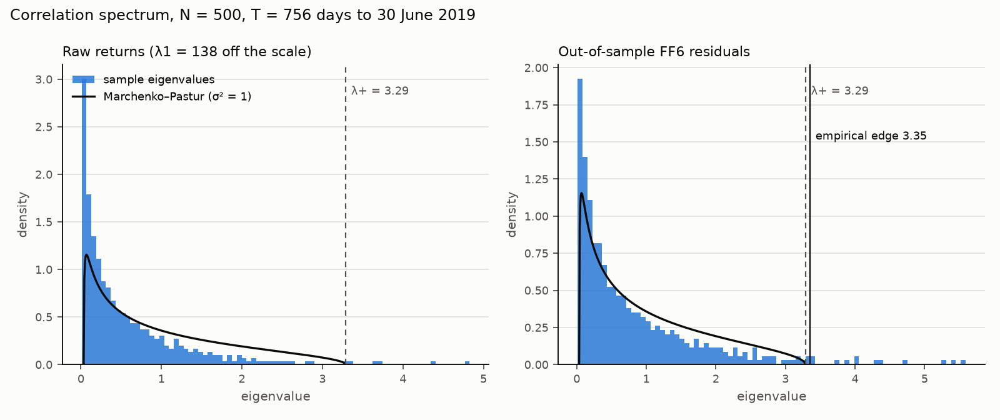

# Element B: inputs and spectra (no text alignment before the PREREG freeze)

Generated by `analysis/b_spectra.py`.

| formation | window | N | dropped >0.95 | q | raw λ1 | raw λ1/N | raw above MP(iter) | resid λ1 | MP λ+ (σ²=1) | MP λ+ (iter σ²) | iter converged | empirical edge | resid above MP(σ²=1) | resid above empirical | median IPR above edge × N | IPR noise ×N |
|---|---|---|---|---|---|---|---|---|---|---|---|---|---|---|---|---|
| 2014-07-01 | 2011-06-28..2014-06-30 | 500 | 0 | 0.661 | 225.1 | 45.0% | 36 | 19.58 | 3.288 | 2.408 | False | 3.317 | 21 | 21 | 3.35 | 2.99 |
| 2015-07-01 | 2012-06-27..2015-06-30 | 500 | 0 | 0.661 | 156.5 | 31.3% | 37 | 20.96 | 3.288 | 2.369 | False | 3.334 | 23 | 22 | 3.74 | 2.99 |
| 2016-07-01 | 2013-07-02..2016-06-30 | 500 | 0 | 0.661 | 175.9 | 35.2% | 38 | 27.37 | 3.288 | 2.306 | False | 3.338 | 22 | 21 | 3.27 | 2.99 |
| 2017-07-01 | 2014-07-02..2017-06-30 | 500 | 0 | 0.661 | 166.1 | 33.2% | 39 | 29.94 | 3.288 | 2.251 | False | 3.323 | 22 | 21 | 3.23 | 2.99 |
| 2018-07-01 | 2015-07-01..2018-06-29 | 500 | 0 | 0.661 | 154.5 | 30.9% | 40 | 27.39 | 3.288 | 2.277 | False | 3.328 | 22 | 22 | 3.41 | 2.99 |
| 2019-07-01 | 2016-06-28..2019-06-28 | 500 | 0 | 0.661 | 138.2 | 27.6% | 40 | 25.46 | 3.288 | 2.282 | False | 3.353 | 22 | 20 | 3.4 | 2.99 |
| 2020-07-01 | 2017-06-29..2020-06-30 | 500 | 0 | 0.661 | 224.1 | 44.8% | 45 | 31.97 | 3.288 | 1.926 | False | 3.346 | 25 | 24 | 3.13 | 2.99 |
| 2021-07-01 | 2018-06-29..2021-06-30 | 500 | 0 | 0.661 | 212.2 | 42.4% | 45 | 32.5 | 3.288 | 1.903 | False | 3.346 | 24 | 24 | 2.96 | 2.99 |
| 2022-07-01 | 2019-07-02..2022-06-30 | 500 | 1 | 0.661 | 216.0 | 43.2% | 44 | 34.62 | 3.288 | 1.822 | False | 3.347 | 25 | 25 | 3.09 | 2.99 |
| 2023-07-01 | 2020-06-30..2023-06-30 | 500 | 1 | 0.661 | 166.0 | 33.2% | 43 | 36.09 | 3.288 | 2.024 | False | 3.35 | 23 | 23 | 3.02 | 2.99 |
| 2024-07-01 | 2021-06-28..2024-06-28 | 500 | 0 | 0.661 | 164.1 | 32.8% | 42 | 31.38 | 3.288 | 2.086 | False | 3.34 | 23 | 22 | 3.22 | 2.99 |
| 2025-07-01 | 2022-06-24..2025-06-30 | 500 | 0 | 0.661 | 157.2 | 31.4% | 42 | 36.25 | 3.288 | 2.117 | False | 3.345 | 22 | 22 | 3.08 | 2.99 |

raw above MP(iter): eigenvalues of the raw-return correlation matrix above the MP edge with the iterated σ². Residual columns use out-of-sample FF6 residuals (rolling betas). Empirical edge: 95th percentile of the top eigenvalue over 200 circular-shift nulls. IPR × N: 1 = spread evenly over all N stocks, 3 = random vector, large = localised.

Runtime 34 s.
